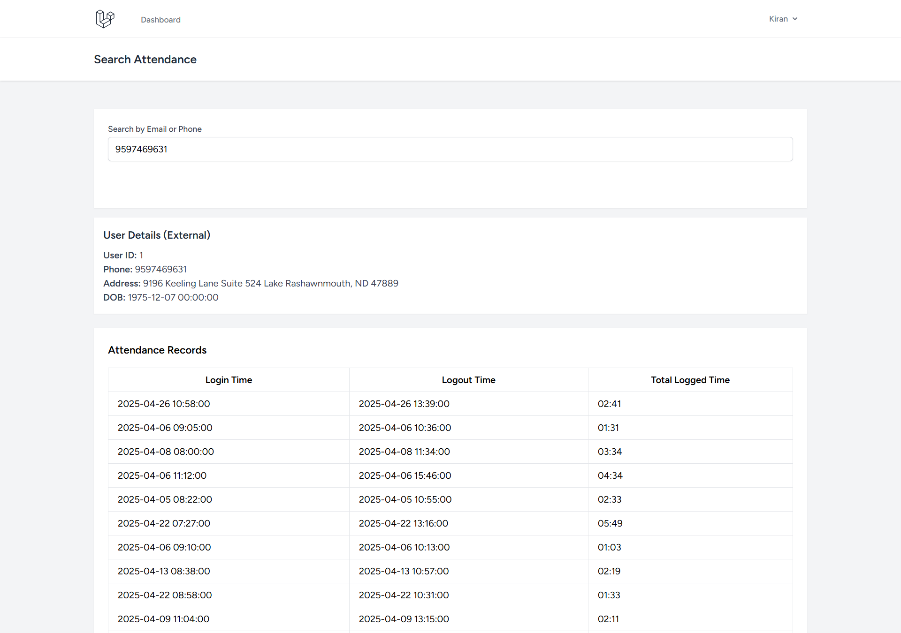

# Toolyt Attendance Management System

A simple Laravel-based web application to manage and search employee attendance records for both internal and external users. This project is designed for demonstration and interview purposes, with a focus on clean code, usability, and realistic data.

## Features

- **User Authentication**: Secure login system using Laravel Breeze.
- **Attendance Search**: Search attendance records by email or phone number for both internal and external users.
- **User Types**: Supports both internal and external users, each with their own details.
- **Demo Data**: Database seeder creates demo users and 1,000 attendance records for realistic testing.

---

## Getting Started

Follow these steps to set up and run the project locally:

### 1. Clone the Repository

```bash
git clone https://github.com/kiranCodings/toolyt-attendance.git
cd toolyt-attendance
```

### 2. Install Dependencies

```bash
composer install
```

### 3. Configure Environment

- Copy the example environment file:
  ```bash
  cp .env.example .env
  ```
- Update your `.env` file with your local database credentials:
  ```env
  DB_DATABASE=your_database_name
  DB_USERNAME=your_db_user
  DB_PASSWORD=your_db_password
  ```

### 4. Generate Application Key

```bash
php artisan key:generate
```

### 5. Run Migrations

```bash
php artisan migrate
```

### 6. Seed the Database with Demo Data

```bash
php artisan db:seed
```
This will create demo internal and external users, and 1,000 attendance records.

### 7. Serve the Application

```bash
php artisan serve
```
Visit [http://localhost:8000](http://localhost:8000) in your browser.

---

## How to Login

- Register a new user or use one of the demo users created by the seeder.
- After login, you will be redirected to the dashboard.

## Demo: Searching Attendance Records

1. On the dashboard, use the search form to find attendance records by entering an email or phone number.
2. Example demo values to try (from seeded data):
   - Internal User Email: `user@toolyt.com` (if your factory uses this pattern)
   - External User Phone: `9998887770` (if your factory uses this pattern)
   - You can also check the `internal_users` and `external_users` tables in your database for actual demo values.
3. The results will show user details and a table of attendance records, including login/logout times and total time.

---
## Application Screenshots

### Attendance Search
